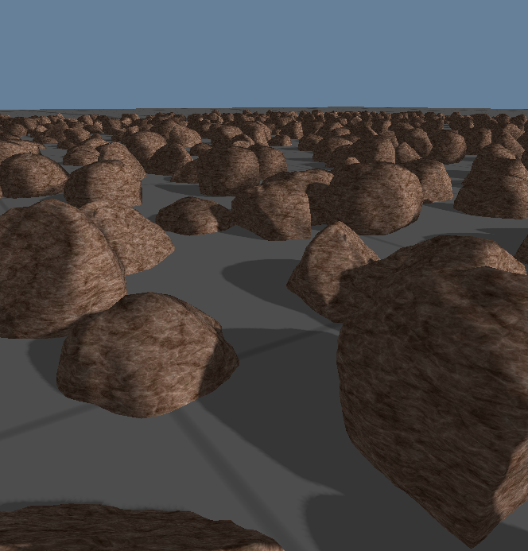

Rock Generation
===============

This is a test of procedural rock generation for Project Magrathea, or anything else that uses rocks.  It borrows heavily from [Erkaman's gl-rock repo](https://github.com/Erkaman/gl-rock) in concept.

Licencing
---------

This project is licenced under the MIT licence as detailed in the file `LICENCE`.  However, certain shader program files have been copied from other projects.  In these cases, `LICENCE` files in the relevant directories detail the licence that applies.
